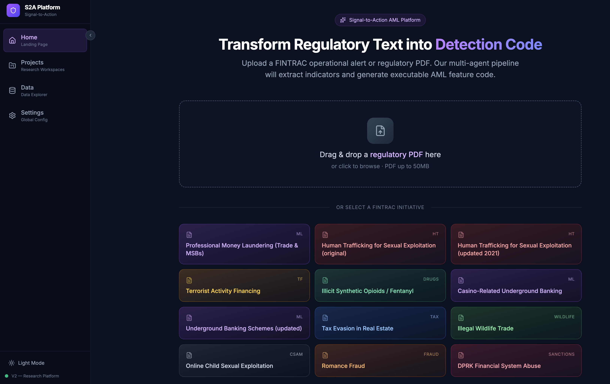
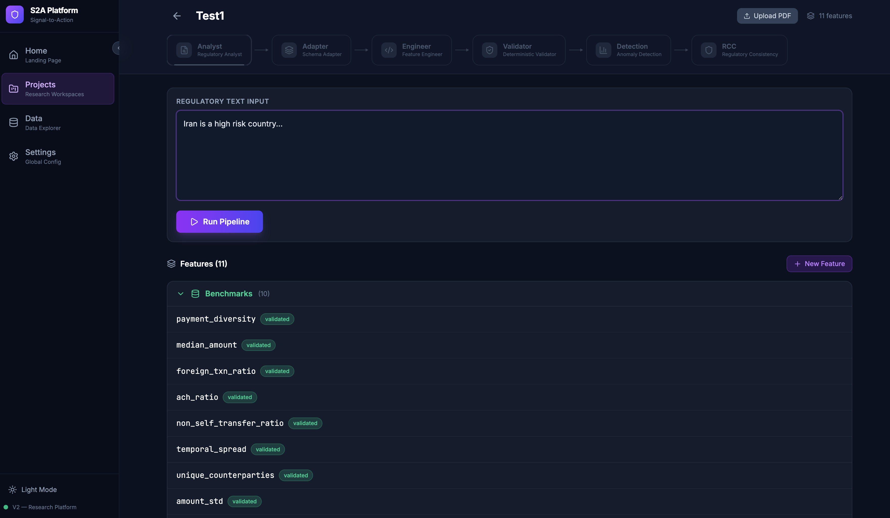
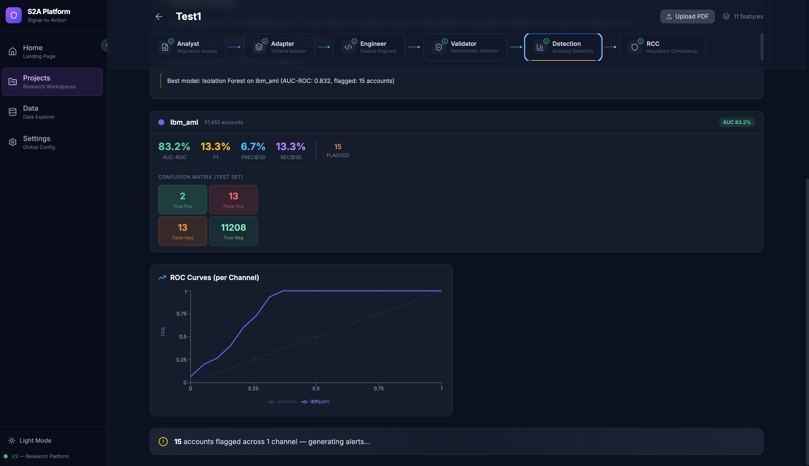
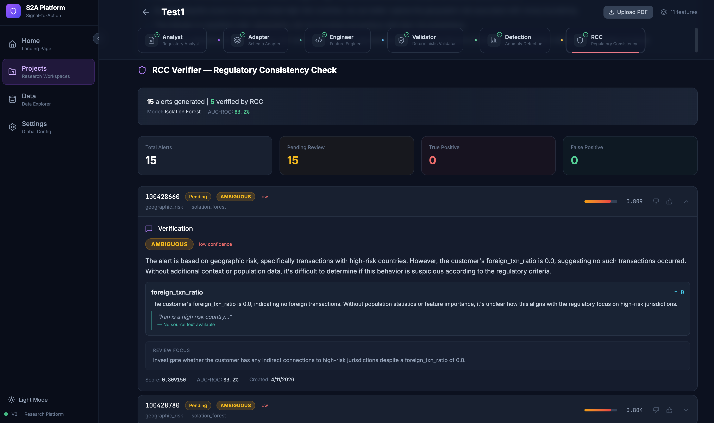

# S2A Platform — Signal-to-Action

> **An Agentic LLM Architecture for Automated AML Feature Engineering**
>
> Regulatory text → 6 AI agents → executable detection features → anomaly detection → regulatory verification. End-to-end, fully traceable.

[](https://www.python.org/)
[](https://fastapi.tiangolo.com/)
[](https://react.dev/)
[](https://www.typescriptlang.org/)
[](LICENSE)

---

## Screenshots

| Landing Page | Project Workspace |
|---|---|
|  |  |
| Browse FINTRAC initiatives or upload your own regulatory PDF | 6-tab pipeline + Feature Library with benchmarks |

| Anomaly Detection | RCC Verification |
|---|---|
|  |  |
| Isolation Forest results: AUC, confusion matrix, ROC curves | Per-alert verdicts with regulatory citations and evidence cards |

---

## What is S2A?

**S2A (Signal-to-Action)** is an agentic LLM platform that automates the most painful part of AML (Anti-Money Laundering) detection: turning regulatory documents into working detection features. It takes a piece of regulatory text and runs it through a 6-agent pipeline that compiles it into an executable Python feature, runs anomaly detection, and verifies each alert back against the original regulation.

This system is built around the architecture proposed in *"Regulation In, Regulation Out: An Agentic LLM Architecture for AML"* (Phume Ngam).

### The Problem

Traditional AML feature engineering is:
- **Slow** — 6–12 months from regulatory guidance to deployed detection
- **Subjective** — three analysts reading the same regulation produce three different implementations
- **Hard to audit** — when audit asks "why did you build this feature?", teams can't trace back to the regulation
- **Lossy** — when an analyst leaves, the knowledge goes with them

### The Solution

A specialized multi-agent system where each agent has a clear role, deterministic boundaries between agents, and a closed loop that grounds every alert back to the original regulatory text.

---

## Architecture

```
┌──────────────┐  ┌──────────────┐  ┌──────────────┐  ┌──────────────┐  ┌──────────────┐  ┌──────────────┐
│ ① Regulatory │  │ ② Schema     │  │ ③ Feature    │  │ ④ Validator  │  │ ⑤ Detection  │  │ ⑥ RCC        │
│   Analyst    │→ │   Adapter    │→ │   Engineer   │→ │ (CODE, not   │→ │ (Isolation   │→ │   Verifier   │
│   (LLM)      │  │   (LLM)      │  │   (LLM)      │  │   LLM)       │  │   Forest)    │  │   (LLM)      │
└──────────────┘  └──────────────┘  └──────────────┘  └──────┬───────┘  └──────────────┘  └──────────────┘
                                                              │
                                                  ┌───────────┴───────────┐
                                                  │ Self-Correction Loop  │
                                                  │ + Human-in-the-Loop   │
                                                  └───────────────────────┘

         REGULATION IN  ───────────────────►   DETECT   ───────────►   REGULATION OUT
```

Each agent follows a **Perceive → Reason → Act** loop, producing structured, auditable output at every step.

| # | Agent | Type | Role |
|---|-------|------|------|
| 1 | **Regulatory Analyst** | LLM (GPT-4o) | Extracts structured indicator (category, parameters, computation plan) from raw regulatory text |
| 2 | **Schema Adapter** | LLM (GPT-4o) | Maps the indicator onto the target database schema (per-channel: direct / proxy / infeasible) |
| 3 | **Feature Engineer** | LLM (GPT-4o) | Generates Python `compute_feature()` code with regulatory provenance comments |
| 4 | **Deterministic Validator** | Pure code (no LLM) | AST safety check, column alignment, KS/IV statistical validation. Has the power to send any prior agent back for rework |
| 5 | **Anomaly Detection** | Isolation Forest | Runs unsupervised detection on benchmark + compiled features |
| 6 | **RCC Verifier** | LLM (GPT-4o) | Verifies each alert against the *same* regulatory text that compiled the feature |

### Why Multi-Agent?

A single LLM call can generate code, but it can't:
- Independently validate its own output
- Run deterministic safety checks
- Pinpoint which step failed
- Self-correct with structured feedback

The value is not in *generation* — it's in **validated, auditable generation with self-correction**.

---

## Key Concepts

### Regulatory Feature Specification (RFS)

The RFS is the structured artifact the pipeline produces. It contains everything needed to understand, validate, and reuse a feature:

```
RFS = (b, D, f, P, V)
       │  │  │  │  │
       │  │  │  │  └─ Validation Evidence (KS, IV, AUC, RCC verdicts)
       │  │  │  └─── Provenance (PRA reasoning trail + regulatory citations)
       │  │  └────── Function (executable Python code)
       │  └───────── Data Requirements (per-channel schema mapping)
       └──────────── Behavior (category, risk rationale, thresholds)
```

Stored across `Feature`, `FeatureContext`, `DetectionRun`, and `Alert` tables. Good features can be promoted to a **Feature Library** for reuse across future typologies — solving the knowledge preservation problem.

### Closed-Loop Grounding

The original regulatory text is preserved throughout the entire pipeline. It's used to compile the feature at the start, and used again to verify the alerts at the end. Same source text, end-to-end traceability.

### Self-Correction with Human-in-the-Loop

- **Code-level errors** (banned imports, missing columns): up to 5 automatic retry iterations
- **Statistical failure** (IV < 0.02): immediate human decision point with options narrowing as choices are tried
  - Rethink Indicator (back to Analyst)
  - Rethink Code (back to Engineer)
  - Continue with Benchmarks
  - Stop Pipeline

---

## Tech Stack

**Backend**
- Python 3.13+, FastAPI, uvicorn
- SQLite + SQLAlchemy 2.0
- OpenAI AsyncOpenAI (GPT-4o)
- scikit-learn (Isolation Forest), scipy (KS test), numpy

**Frontend**
- React 19 + Vite + TypeScript
- Tailwind CSS v4
- Framer Motion (animations)
- Recharts (ROC curves, distributions)
- Server-Sent Events (SSE) for real-time pipeline streaming

---

## Project Structure

```
aml-pipeline/
├── s2a/src/
│   ├── backend/
│   │   ├── main.py                       # FastAPI entry point
│   │   ├── config.py                     # Paths, channels, LLM config
│   │   ├── core/
│   │   │   ├── database.py               # SQLite + auto-migration
│   │   │   └── data_loader.py            # Channel data loading
│   │   ├── models/feature.py             # Project, Feature, FeatureContext, DetectionRun, Alert
│   │   ├── routers/                      # API endpoints (s2f, features, projects, alerts)
│   │   ├── validators/
│   │   │   ├── deterministic.py          # 6-stage validation
│   │   │   └── ast_analyzer.py           # AST safety + column extraction
│   │   ├── services/
│   │   │   ├── s2f_service.py            # 5-phase compile pipeline
│   │   │   ├── pipeline_orchestrator.py  # End-to-end orchestration
│   │   │   ├── stats_evaluator.py        # KS/IV per-channel evaluation
│   │   │   ├── detection_runner.py       # ML model training + evaluation
│   │   │   └── alert_explainer.py        # RCC Verifier
│   │   └── utils/trace_logger.py         # SSE trace events
│   └── frontend/src/
│       ├── App.tsx                       # Routes
│       ├── api/client.ts                 # API + SSE streams
│       ├── pages/ProjectDetailPage.tsx   # 6-tab pipeline workspace
│       └── components/pipeline/          # Per-agent tab components
├── data/                                 # AML datasets (gitignored)
├── start.sh                              # One-command startup
└── README.md
```

---

## Datasets

### IBM AML HI-Small (Primary Benchmark)
- **5,078,415 transactions**, 496,995 unique accounts
- 3,376 positive accounts (0.68% laundering rate)
- Source: [IBM AMLSim](https://www.kaggle.com/datasets/ealtman2019/ibm-transactions-for-anti-money-laundering-aml)

### FINTRAC (Schema Adaptation Demo)
- 7 channels: Card (3.5M), EFT (1.1M), EMT (846K), Cheque (241K), ABM (186K), Wire (5K), Western Union (2K)
- Demonstrates multi-channel schema-adaptive compilation

### 10 Benchmark Features (Domain-Agnostic)

Statistical baselines requiring no regulatory knowledge: `total_amount`, `txn_count`, `amount_std`, `unique_counterparties`, `temporal_spread`, `non_self_transfer_ratio`, `ach_ratio`, `foreign_txn_ratio`, `median_amount`, `payment_diversity`.

These establish a baseline. Regulation-compiled features are added on top to measure the marginal detection gain from "Regulation In."

---

## Getting Started

### Prerequisites

- Python 3.13+
- Node.js 18+
- OpenAI API key (GPT-4o)
- IBM AML CSV dataset (place in `data/ibm_aml.csv`)

### Setup

```bash
# 1. Clone
git clone https://github.com/X66YSH/aml-pipeline.git
cd aml-pipeline

# 2. Add your OpenAI API key to .env at the project root
echo "OPENAI_API_KEY=sk-..." > .env

# 3. Place IBM AML data at data/ibm_aml.csv
# (download from Kaggle: ealtman2019/ibm-transactions-for-anti-money-laundering-aml)

# 4. Start everything
./start.sh
```

The script installs dependencies, starts the FastAPI backend on `:8080` and the Vite frontend on `:5173`.

Open **http://localhost:5173** in your browser.

### Manual Setup (if `start.sh` doesn't work)

```bash
# Backend
cd s2a/src/backend
python -m venv .venv && source .venv/bin/activate
pip install -r requirements.txt
uvicorn main:app --host 0.0.0.0 --port 8080 --reload

# Frontend (new terminal)
cd s2a/src/frontend
npm install
npm run dev
```

---

## Demo Flow

### Run 1: Self-Correction

**Input**: `"Iran is a high-risk country"`

1. Analyst extracts `geographic_risk` indicator
2. Engineer generates code → Validator: AST passes, but IV = 0 (Iran transactions too rare)
3. **Decision point**: human chooses Rethink Indicator / Rethink Code / Continue with Benchmarks / Stop
4. System falls back gracefully to benchmark features
5. Detection runs → AUC ~90%

**Story**: *"The system tries, diagnoses failures, and falls back gracefully."*

### Run 2: Full Pipeline

**Input**: A FINTRAC operational alert (e.g. professional money laundering, structuring)

1. All 6 agents work in sequence
2. Compiled feature passes validation (IV > 0.02)
3. Detection runs with 10 benchmark + 1 compiled feature
4. RCC verifies alerts → evidence cards with regulatory citations

**Story**: *"Regulation In → Detection → Regulation Out. Full traceability."*

---

## Results

| Configuration | AUC-ROC | Features |
|---------------|---------|----------|
| 10 benchmark only | baseline | 10 |
| 10 benchmark + compiled | baseline + Δ | 11 |

The Δ demonstrates the marginal detection gain from a *single* regulation-compiled feature.

**Pipeline performance:**
- Compilation time: ~2–3 minutes (vs. days/weeks manually)
- Self-correction: up to 5 automatic iterations
- Traceability: every alert maps back to its regulatory source

---

## Research Directions

1. **Feature Quality Benchmarking** — systematic comparison of S2A-compiled vs. single-pass GPT vs. human-designed features
2. **Self-Correction Pattern Research** — failure rates by indicator category, error taxonomy
3. **Typology Coverage Intelligence** — feature landscape across all FINTRAC typologies
4. **RL-Optimized Correction Agent** — learned correction strategies from accumulated patterns

---

## Author

**Jerry Li** ([@X66YSH](https://github.com/X66YSH))

Research project conducted with the AML Research Team at Scotiabank, March 2026.

---

## License

MIT

---

## Acknowledgments

This work implements the architecture proposed in:

> Ngam, P. *"Regulation In, Regulation Out: An Agentic LLM Architecture for AML"*
